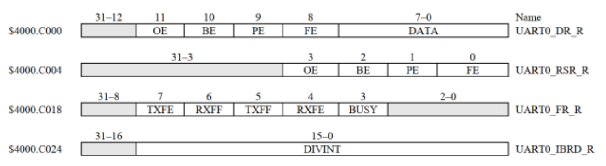

# Using UVM RAL model to verify dummy project

## Overview

This project is a simple demonstration of a verification environment using the Register Abstraction Layer (RAL) in Universal Verification Methodology (UVM). The purpose of this project is to showcase the implementation and verification of a basic register model.

the RAL model was made for real UART register 
1. UART0_DR_R
2. UART0_RSR_R
3. UART0_FR_R
4. UART0_IBRD_R `COMENTED`



## Features

- **Register Model**: A basic register model implemented using RAL.
- **UVM Testbench**: A UVM-based testbench for verifying register functionality.
- **Simulation**: Supports simulation to validate register operations.


## Getting Started
To get started with this repository, follow these steps:
> [!IMPORTANT]
> You need to have [QuestaSim](https://support.sw.siemens.com/en-US/) installed on your machine.

1. Clone the repository to your local machine using the following command:
```
git clone https://github.com/Abdelrahman1810/UVM-RAL-verification-model.git
```

4. Compile and Simulate the Verilog files by executing the following command in the QuestaSim transcript tap: 
```ruby
do run.do
```
This will compile All files in Codes folder.

## Contributing
If you find any issues or have suggestions for improvement, feel free to submit a pull request or open an issue in the repository. Contributions are always welcome!

## Contact info 💜
<a href="https://linktr.ee/A_Hassanen" target="_blank">
  
</a> 
<br>
<br>

## Resources
- [Verification Academy](https://verificationacademy.com/)
- [RAL Tutorial](https://cluelogic.com/2013/02/uvm-tutorial-for-candy-lovers-register-access-methods/)
- [chipverify](https://www.chipverify.com/uvm/uvm-register-layer#google_vignette)
- [Document: Advanced UVM Using the Register Layer](https://picture.iczhiku.com/resource/eetop/sHKDraQFPARtwmMn.pdf)
- [RAL sub-examble](https://verificationguide.com/uvm-ral-example/uvm-ral-example-dma/)
- youtube videos
    - [vedio 1](https://www.youtube.com/watch?v=3N5JDIHQ4f0)
    - [vedio 2](https://www.youtube.com/playlist?list=PLDAnhhk0KczwvgPh5sWhRP4e8I7HH9Bge)
    - [vedio 3](https://youtu.be/8F5nLB5zL-0?feature=shared)
    
